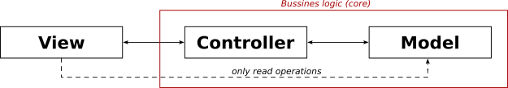
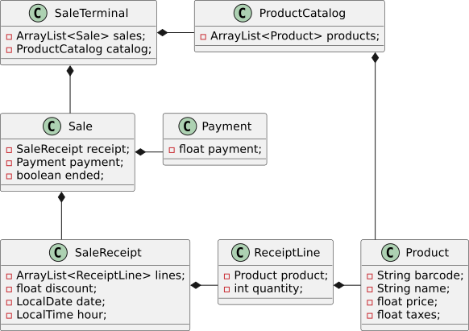
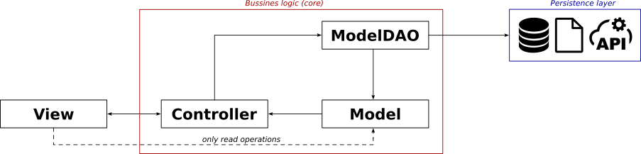
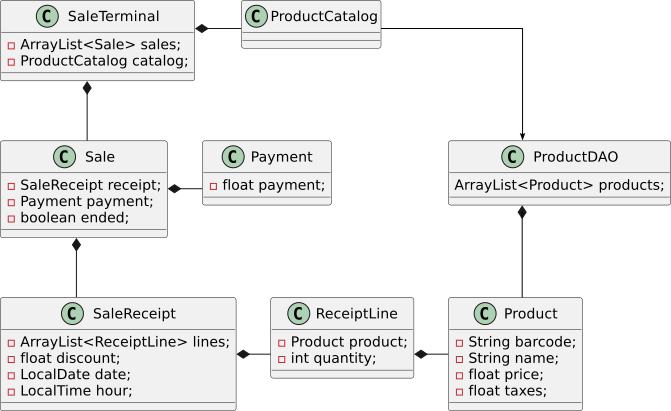
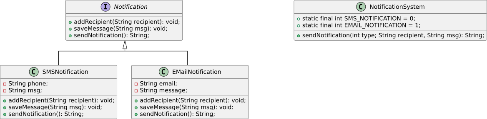
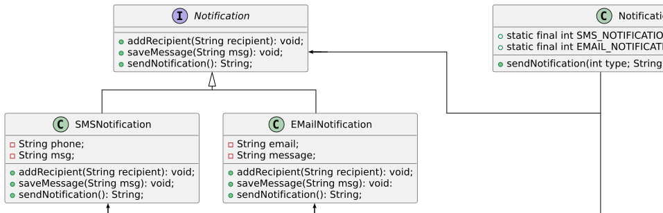

# Els patrons de disseny de software

Un patró de disseny de software permet avaluar i organitzar el codi implementat seguint el paradigma POO (programació orientada a objectes) per tal que aquest sigui tant modular, reutilitzable i de fàcil manteniment i ampliació com sigui possible.

De patrons de software n'existeixen molts, però els clàssics i, per tant, els més utilitzats, són un grup de 22, els quals estan organitzats en 3 categories principals:
* Patrons de creació
    * Factory Method
    * Abstract Factory
    * Builder
    * Prototype
    * Singleton
* Patrons estructurals
    * Adapter
    * Bridge
    * Composite
    * Decorator
    * Facade
    * Flyweight
    * Proxy
* Patrons de comportament
    * Chain of Responsibility
    * Command
    * Iterator
    * Mediator
    * Memento
    * Observer
    * State
    * Strategy
    * Template Methor
    * Visitor

Tots aquests patrons s'implementen sobre un conjunt de principis bàsics anomenats **GRASP** (*General Responsibility Assignment Software Patterns*). Si el codi POO no compleix aquests principis serà molt difícil dissenyar una arquitectura modular, adaptable i reutilitzable. En canvi, si el disseny està ben pensat, i l'aplicació està implementada seguint l'arquitectura **MVC** (*Model-View-Controller*), el codi complirà tots els requeriments de modularitat, reutilització, bon manteniment i fàcil ampliació desitjats.


**Avís.**

Cal tenir en compte que, en alguns casos, la POO i una arquitectura de sotware massa estricta poden fer que una aplicació perdi eficiència. Per tant, cal analitzar molt bé el problema a resoldre per tal de decidir la càrrega de disseny que necessita.


Aquest capítol tracta els següents coneixements:
* Patró d'assignació de responsabilitats *Expert*
* Patró d'assignació de responsabilitats *Creator*
* Patró d'assignació de responsabilitats *Controller*
* Patró estructural *Data Access Object* (DAO)
* Patró clàssic de creació *Factory Method*
* Aquitectura MVC

## GRASP (*General Responsibility Assignment Software Patterns*)
L'objectiu principal dels principis GRAPS és aconseguir el mínim acoblament i la màxima cohesió en el codi implementat.

**Acoblament**: dependència que existeix entre les diferents classes/objectes que formen part del codi. Si dues classes (o objectes) estan acoblades vol dir que estan connectades, que tenen coneixement o que depenen l'una de l'altra. Això passa si:
1. La classe `A` té un atribut de la classe `B`.
2. La classe `A` té un mètode que utilitza la classe `B` (per exemple, retorna un objecte de `B`, rep un paràmetre de tipus `B` o crea un objecte de la classe `B` per fer els seus càlculs)
3. La classe `A` és una subclasse de `B`
4. La classe `A` implementa la interfície `B`

Si el codi implementat no gestiona correctament l'acoblament entre les classes, arribarà un moment en què serà molt difícil de treballar: els errors afectaran a moltes classes i costaran d'arreglar, no serà fàcilment ampliable ni modificable, no serà modular, etc.

**Cohesió**: una classe està cohesionada si les tasques que realitza (comportament, mètodes) estan focalitzades (conjunt reduït de funcionalitats) i estan relacionades entre si i amb les dades que emmagatzema (estat, atributs). En el moment en què una classe comença a fer *massa coses*, la seva cohesió baixa i, per tant, serà difícil de mantenir i de reutilitzar, així com també, es veurà afectada per moltes modificacions.

La cohesió afavoreix la col·laboració entre les classes (delegació de tasques).

### Patró d'assignació de responsabilitats *Expert*
El Patró *Expert* indica que cada classe/objecte és responsable de fer els càlculs per als quals té la informació necessària. És a dir, la classe (o l'objecte) és l'experta en informació i, per tant, és la responsable d'operar (mètodes) les seves dades (atributs). Dit d'una altra manera, cada classe/objecte té els mètodes necessaris que permeten operar els atributs que emmagatzema.

Si una classe (o un objecte) no té totes les dades necessàries per poder executar un dels seus mètodes es diu que és una *experta parcial en informació* i, per tant, haurà de col·laborar amb els objectes dels seus propis atributs, és a dir, haurà de delegar els càlculs als objectes que formen part dels seus atributs.

Aquest patró genera un baix desacoblament en el codi, perquè permet mantenir un molt bon encapsulament dels objectes i saber, clarament, qui pot donar resposta a les diverses necessitats i càlculs. A més a més, també n'augmenta la cohesió, perquè ajuda a fer una bona representació del món real dins del codi, distribuïnt el comportament entre les classes i facilitant la delegació de tasques (col·laboració).


**Informació.**

El patró d'assignació de responsabilitats *Expert* està molt relacionat amb el patró clàssic estructural *Composite* 




**Exercici**

Donat el diagrama de classes UML que es mostra a continuació, cal declarar i implementar tots els mètodes necessaris per poder assolir la funcionalitat *obtenir el total del tiquet de la compra*. El llenguatge que s'ha d'utilitzar és Java.

<div data-with-frame="true">
    <figure>
        
        <figcaption><p>Diagrama UML de Classes que mostra un exemple inicial per aplicar el Patró *Expert*</p></figcaption>
    </figure>
</div>

Atenció, només s'han d'implementar els mètodes estrictament necessaris. A més a més, tampoc fa falta crear el constructor, ja que, de moment,  es treballarà amb el constructor per defecte que garanteix Java.


### Patró d'assignació de responsabilitats *Creator*
El Patró *Creator* indica quina classe és la responsable de crear una nova instància d'una altra classe i es regeix per les normes següents:
1. La classe `A` té un atribut de la classe `B`, `A` serà responsable de crear la instància de `B`.
2. La classe `A` utilitza objectes de la classe `B` (per exemple, com a variables locals o retorn dels seus mètodes), `A` serà responsable de crear la instància de `B`.
3. Si la classe `A` té les dades d'inicialització per crear objectes de la classe `B`, `A` serà responsable de crear la instància de `B`.

En cas d'empat entre diverses possibilitats, es dóna preferència a la primera opció (la classe `A` té un atribut de la classe `B`).

Analitzant la seva definició, es pot veure que l'aplicació del patró *Creator* implica, directament, la del patró *Expert*: la classe que crea una instància ho fa perquè és l'experta, la que gestiona les dades per poder-ho fer.


**Exercici**

Recuperant l'exercici anterior, qui és el responsable de crear instàncies de la classe `ReceiptLine`? Implementa el constructor per defecte que creguis més adequat.


### Patró d'assignació de responsabilitats *Controller*
El Patró *Controller* s'encarrega de definir la classe/objecte encarregada de gestionar els esdeveniments del sistema, és a dir, les instruccions rebudes a través de la interacció amb l'usuari. El seu objectiu principal és desacoblar la interfície gràfica (qui interactua amb l'usuari; *view*) de la lògica de negoci (*controller* i *model*), de tal manera que qualsevol canvi a la interfície gràfica no afecti al nucli (*core*) del programa.

Pel que fa als canvis dins del *core*, afectaran, o no, a la interfície gràfica depenent de quina sigui la seva naturalesa:
* Canvis per a corregir errors: no haurien d'afectar a no ser que impliquin algun canvi en com es volen mostrar les dades a l'usuari
* Canvis per ampliar les funcionalitats: afectaran la interfície gràfica perquè s'haurà de crear noves pantalles o noves eines d'interacció per poder cridar aquestes noves funcionalitats

<div data-with-frame="true">
    <figure>
        
        <figcaption><p>Aplicació del Patró *Controller* per separar la interfície gràfica de la lògica de negoci</p></figcaption>
    </figure>
</div>

El *Controller* és el *cervell* que gestiona tot el sistema:
1. Exposa a la *View* totes les funcionalitats de les quals disposa (d'això se'n diu *interface*)
2. Captura els esdeveniments del sistema (els esdeveniments que activa l'usuari durant la seva interacció amb la interfície gràfica)
3. Transforma aquests esdeveniments del sistema en operacions del sistema, delegant al *Model* els càlculs necessaris per donar resposta a les peticions

Analitzant la imatge anterior, també podem veure que la *View* pot accedir als *Model* per poder mostrar-ne la seva informació a l'usuari, és a dir, només en mode lectura (la *View* **mai** pot modificar el *Model* directament, sinó que sempre ho ha de fer a través d'esdeveniments del sistema tractats pel *Controller*). Això implica que el *Model* ha d'estar implementat tenint en ment aquesta restricció, la qual cosa es pot assolir mitjançant dues metodologies:
1. Ha de ser un *Model* que només tingui mètodes de lectura: els constructors parametritzat i còpia (s'elimina el constructor per defecte perquè implica necessitar els mètodes *setter*), mètodes *getter* i mètodes de consulta, com poden ser, en Java, el mètode `equals()`, el mètode `hashcode()` i el mètode `toString()`.
2. En cas que el *Model* necessiti implementar mètodes que en modifiquin les propietats (atributs), com per exemple poden ser els *setter* en cas d'existir el constructor per defecte, o qualsevol altre mètode que impliqui la realització de càlculs i la modificació de la instància associada, caldrà aplicar diverses tècniques que garanteixin que si s'invoquen des de la *View*, fent una mala praxi, la instància corresponent dins del *core* del programa no queda modificada. Això depèn de les eines que facilita el llenguatge de programació i, per exemple, en C++ es pot obtar per a crear mètodes constants (garanteixen que l'estat - atributs - de l'objecte no es modifica) o que retornin objectes constants; en Java, en canvi, s'ha de fer a través d'objectes immutables.

Per escollir el millor *Controller* per al programa cal analitzar-ne la seva mida, és a dir, el nombre total de funcionalitats que tindrà el *software*.
* En cas d'una aplicació petita amb un conjunt reduït de funcionalitats s'escollirà la classe que representa tot el sistema global. D'això se n'anomena *Facade Controller* i està relacionat amb el patró clàssic *Facade*.
* Si l'aplicació és molt gran i té múltiples mòduls o casos d'ús, es crearan diversos "Use-Case Controller" (un *controller* per cada cas d'ús de l'aplicació) per mantenir un l'acoblament baix i una cohesió alta.


**Informació.**

El patró d'assignació de responsabilitats *Controller* és el precusor de l'arquitectura *Model-View-Controller* (MVC) 



**Exercici**

Recuperant el problema anterior, cal afegir-hi les operacions de sistema següents:
1. `createNewSale()`
2. `addProductTo(barcode, quantity)`
3. `endSale()`
4. `paySale(money)`

Això es pot fer utilitzant un *Facade Controller* (per exemple, `SaleTerminal` o `Shop`) o un *Use-Case Controller* (per exemple, `SalesController`). En aquest exercici es proposa crear el *controller* `SalesTerminal`, el qual ha de seguir les especificacions següents:
1. Ha de poder emmagatzemar les múltiples vendes que realitza l'aplicació; les vendes són instàncies de la classe `Sale` (vegeu diagrama UML associat)
2. `createNewSale()`: s'ha de crear una nova instància de `Sale`, la qual contindrà una instància de `SaleReceipt` i una instància de `Payment`
3. `addProduct(barcode, quantity)`: s'ha de poder afegir una nova línia de compra (`ReceiptLine`) a la venda actual; aquesta línia ha de correspondre al producte amb el codi de barres `barcode`
4. `endSale()`: marca la venda (`Sale`) com a finalitzada i retorna el total
5. `paySale(money)`: retorna el canvi que s'ha de donar a l'usuari

Addicionalment, per tal de poder seleccionar els productes correctament per crear les instàncies de `ReceiptLine` es necessita la classe `ProductsCatalog`, que quedarà associada al *controller* `SaleTerminal` (aquest punt variarà més endavant) i serà l'encarregada de carregar tots els productes des de fitxer i de, donat un codi de barres, retornar el producte corresponent. Els productes es troben en el següent fitxer `CSV`:

```
Codi de barres;Nom;Preu unitari;IVA
8412345000001;Llet sencera 1 L;1.05;4
8412345000002;Pa de pagès 500 g;1.80;4
8412345000003;Ous mida L (dotzena);2.75;4
8412345000004;Arròs rodó 1 kg;1.65;4
8412345000005;Pasta de blat 500 g;1.20;10
8412345000006;Oli d'oliva verge extra 1 L;8.95;10
8412345000007;Iogurt natural 4 unitats;1.90;4
8412345000008;Formatge semi 250 g;4.25;4
8412345000009;Pernil dolç 150 g;2.35;10
8412345000010;Tonyina en conserva 3 x 80 g;3.60;10
8412345000011;Tomàquet fregit 350 g;1.45;10
8412345000012;Cereals de blat de moro 500 g;2.85;10
8412345000013;Galetes de xocolata 300 g;2.40;10
8412345000014;Xocolata negra 100 g;1.95;10
8412345000015;Cafè mòlt 250 g;3.75;10iva
8412345000016;Aigua mineral 1,5 L;0.65;10
8412345000017;Refresc de cola 2 L;2.10;21
8412345000018;Cervesa sense alcohol 33 cl;0.95;21
8412345000019;Patates fregides 150 g;1.70;10
8412345000020;Gelat de vainilla 500 ml;4.50;10
```

Implementa totes les classes implicades en aquest exercici, així com també el programa `main`, que farà d'interfície gràfica.
La lectura i el tractament del fitxer la pots fer mitjançant la lectura clàssica o mitjançant *streams*.

<div data-with-frame="true">
    <figure>
        
        <figcaption><p>Diagrama UML de Classes amb l'aplicació el Patró *Controller*</p></figcaption>
    </figure>
</div>



## Patró estructural *Data Access Object* (DAO)
El patró *Data Access Object** (DAO) és un patró estructural que permet aïllar la lògica de negoci (el nucli del programa) de la capa de persistència, és a dir, de les múlitples fonts de dades a les quals pot accedir (bases de dades relacionals, fitxers, bases de dades documentals, etc.). D'aquesta manera, l'aplicació pot obtenir les dades a través de les típiques operacions CRUD (*Create*, *Read*, *Update* i *Delete*) sense necessitat de conèixer l'estructura interna de la font a la qual s'està accedint, ja que aquestes operacions les fa l'objecte DAO (vegeu la figura de sota).

<div data-with-frame="true">
    <figure>
        
        <figcaption><p>Aplicació del Patró *Data Acces Object* per separar la capa de persistència de la lògica de negoci</p></figcaption>
    </figure>
</div>

El flux de treball d'aquest patró és el següent:
1. Quan el *Controller* (o qualsevol objecte de la lògica de negoci) necessita accedir a les dades, crea un objecte *ModelDAO*
2. Fet això, el *Controller* demana que el *ModelDAO* executi l'accés a dades necessari i, per tant, el *ModelDAO*:
    1. accedeix a les dades,
    2. crea l'objecte *Model* corresponent i
    3. retorna aquest objecte *Model* amb les dades sol·licitades.
3. A partir d'aquí, el *Controller* pot retornar el *Model* a la *View* per presentar les dades directament o, per contra, pot realitzar operacions sobre aquest *Model* que, ben segur, en provocaran la seva modificació. Si passa això, el *Controller* haurà de demanar al *ModelDAO* que també actualitzi la font de dades.

El patró *Data Access Object* està molt relacionat amb el patró *Factory Method*, que s'estudia en el següent apartat.


**Exercici**

Recupera i modifica el codi de l'exercici anterior per tal que l'encarregada de tractar el fitxer `CSV` amb les dades dels productes sigui la classe `ProductDAO`. En aquesta implementació, la classe `ProductCatalog` serà, simplement, un reflex de `ProductDAO`, però en el següent apartat això ja variarà.

<div data-with-frame="true">
    <figure>
        
        <figcaption><p>Diagrama UML de Classes amb l'aplicació el Patró *Data Acces Object*</p></figcaption>
    </figure>
</div>



## Patró clàssic de creació *Factory Method*
Donada una jerarquia d'objectes, el patró *Factory Method* consisteix a crear un mètode que permeti crear una instància d'una de les classes de la jerarquia en concret, de tal manera que l'objecte que invoca aquest mètode no ha de conéixer la classe en concret de l'objecte que està creant, sinó només la seva superclasse. D'aquesta manera s'aconsegueix un major desacoblament dins del codi.

Imaginem que cal implementar el programa definit pel diagrama UML següent, on la superclasse de la jerarquia, en aquest cas `Notification`, pot ser una classe *normal*, una classe abstracta o una interfície:

<div data-with-frame="true">
    <figure>
        
        <figcaption><p>Diagrama UML de Classes inicial per explicar el patró *Factory Method*</p></figcaption>
    </figure>
</div>

Un possible codi resultant és el següent:
```java
    public interface Notification {
        public void addRecipient(String recipient);
        public void saveMessage(String msg);
        public String sendNotification();
    }


    public class SMSNotification implements Notification {
        private String phone;
        private String msg;

        public SMSNotification() {
            this.phone = "";
            this.msg = "";
        }

        public void addRecipient(String recipient) {
            this.phone = recipient;
        }

        public void saveMessage(String msg) {
            this.msg = msg;
        }

        public String sendNotification() {
            return "Enviant SMS al telèfon " + this.phone + "...\n Missatge enviat: " + this.msg;
        }
    }

    public class EMailNotification implements Notification {
        private String email;
        private String msg;

        public EMailNotification() {
            this.email = "";
            this.msg = "";
        }

        public void addRecipient(String recipient) {
            this.email = recipient;
        }

        public void saveMessage(String msg) {
            this.msg = msg;
        }

        public String sendNotification() {
            return "Enviant correu electrònic a l'adreça " + this.email + "...\n Missatge enviat: " + this.msg;
        }
    }

    public class NotificationSystem {
        public static final int SMS_NOTIFICATION = 0;
        public static final int EMAIL_NOTIFICATION = 1;
    
        public String sendNotification(int type, String recipient, String msg) {
            Notification notification = null;
            String result = "";

            if(type == NotificationSystem.SMS_NOTIFICATION) {
                notification = new SMSNotification();
            } else if(type == NotificationSystem.EMAIL_NOTIFICATION) {
                notification = new EMailNotification();
            }

            if(notification != null) {
                notification.addRecipient(recipient);
                notification.saveMessage(msg);
                result = notification.sendNotification();
            }

            return result
        }
    }
```
Podem veure que aquest codi provoca que el sistema de notificacions (`NotificationSystem`) quedi acoblat a tota la jerarquia de notificacions (`Notification`), la qual cosa no és massa interessant.

<div data-with-frame="true">
    <figure>
        
        <figcaption><p>Acoblament provocat quan no s'utilitza el patró *Factory Method*</p></figcaption>
    </figure>
</div>

Per resoldre aquest problema podem fer-ho de dues maneres:
1. Utilitzant una *Simple Factory* amb un *Factory Method* parametritzat que crei l'objecte desitjat
2. Utilitzant una jerarquia de *factories* equivalent a la jerarquia dels objectes que volem crear; cadascuna d'aquestes *factories* tindrà un *Factory Method* **sense paràmetres** que crearà l'objecte concret.

La primera opció és més senzilla (implementa el patró *Simple Factory*, una simplificació del *Factory Method) i la segona opció és el patró *Factory Method* estàndard.

### Implementació de l'opció 1: *Simple Factory*
El diagrama UML corresponent a aquesta opció seria el següent:

<div data-with-frame="true">
    <figure>
        
        <figcaption><p>Diagrama UML de Classes aplicant el patró *Factory Method* mitjançant *Simple Factory*</p></figcaption>
    </figure>
</div>

Es pot comprovar que, en aquest cas, l'acoblament es traspassa a la classe *factory*. A canvi, però, la classe principal del sistema (`NotificationSystem`) queda completament alliberada.

El codi d'aquest cas seria el que es mostra a continuació.
```java
    public interface Notification {
        public void addRecipient(String recipient);
        public void saveMessage(String msg);
        public String sendNotification();
    }


    public class SMSNotification implements Notification {
        private String phone;
        private String msg;

        public SMSNotification() {
            this.phone = "";
            this.msg = "";
        }

        public void addRecipient(String recipient) {
            this.phone = recipient;
        }

        public void saveMessage(String msg) {
            this.msg = msg;
        }

        public String sendNotification() {
            return "Enviant SMS al telèfon " + this.phone + "...\n Missatge enviat: " + this.msg;
        }
    }

    public class EMailNotification implements Notification {
        private String email;
        private String msg;

        public EMailNotification() {
            this.email = "";
            this.msg = "";
        }

        public void addRecipient(String recipient) {
            this.email = recipient;
        }

        public void saveMessage(String msg) {
            this.msg = msg;
        }

        public String sendNotification() {
            return "Enviant correu electrònic a l'adreça " + this.email + "...\n Missatge enviat: " + this.msg;
        }
    }

    public class NotificationSimpleFactory {
        public static final int SMS_NOTIFICATION = 0;
        public static final int EMAIL_NOTIFICATION = 1;

        public Notification createNotification(int type) {
            Notification notification = null;

            if(type == NotificationSystem.SMS_NOTIFICATION) {
                notification = new SMSNotification();
            } else if(type == NotificationSystem.EMAIL_NOTIFICATION) {
                notification = new EMailNotification();
            }
            
            return notification;
        }

    }

    public class NotificationSystem {
        public String sendNotification(int type, String recipient, String msg) {
            NotificationSimpleFactory factory = new NotificationSimpleFactory();
            Notification notification = factory.createNotification(type);
            String result = "";

            if(notification != null) {
                notification.addRecipient(recipient);
                notification.saveMessage(msg);
                result = notification.sendNotification();
            }

            return result
        }
    }
```

### Implementació de l'opció 2: jerarquia de *factories* (*Factory Method* estàndard)
En aquest cas, es minimitza l'acoblament generalitzat de l'aplicació afegint una jerarquia de *factories* equivalent a la dels objectes que es volen crear.

<div data-with-frame="true">
    <figure>
        
        <figcaption><p>Diagrama UML de Classes aplicant el patró *Factory Method* estàndard</p></figcaption>
    </figure>
</div>

El codi d'aquest cas seria el que es mostra a continuació.
```java
    public interface Notification {
        public void addRecipient(String recipient);
        public void saveMessage(String msg);
        public String sendNotification();
    }


    public class SMSNotification implements Notification {
        private String phone;
        private String msg;

        public SMSNotification() {
            this.phone = "";
            this.msg = "";
        }

        public void addRecipient(String recipient) {
            this.phone = recipient;
        }

        public void saveMessage(String msg) {
            this.msg = msg;
        }

        public String sendNotification() {
            return "Enviant SMS al telèfon " + this.phone + "...\n Missatge enviat: " + this.msg;
        }
    }

    public class EMailNotification implements Notification {
        private String email;
        private String msg;

        public EMailNotification() {
            this.email = "";
            this.msg = "";
        }

        public void addRecipient(String recipient) {
            this.email = recipient;
        }

        public void saveMessage(String msg) {
            this.msg = msg;
        }

        public String sendNotification() {
            return "Enviant correu electrònic a l'adreça " + this.email + "...\n Missatge enviat: " + this.msg;
        }
    }

    public interface NotificationFactory {
        public Notification createNotification();
    }

    public SMSNotificationFactory implements NotificationFactory {
        public Notification createNotification() {
            return new SMSNotification();
        }
    }

    public EMailNotificationFactory implements NotificationFactory {
        public Notification createNotification() {
            return new EMailNotificationFactory();
        }
    }

    public class NotificationSystem {
        public String sendNotification(NotificationFactory factory, String recipient, String msg) {
            Notification notification = factory.createNotification();
            String result;

            notification.addRecipient(recipient);
            notification.saveMessage(msg);
            result = notification.sendNotification();

            return result
        }
    }
```


**Exercici**

Més endavant es presentarà un exercici on s'haurà d'aplicar el patró *Factory Method* a l'exercici que s'ha anat ampliant al llarg d'aquest capítol, però abans de poder-ho fer cal conéixer altres conceptes que es presenten als Capítols 2 i 3 del llibre.

Així doncs, per practicar el *Factory Method* es demana que s'apliqui aquest patró, tant en la seva versió *Simple Factory* com en la seva versió estàndard, sobre el diagrama UML que es mostra a continuació. Aquest patró ha de permetre crear objectes de tipus `Pizza`.

<div data-with-frame="true">
    <figure>
        
        <figcaption><p>Diagrama UML de Classes per aplicar el patró *Factory Method*</p></figcaption>
    </figure>
</div>

Implementa totes les classes implicades en aquest exercici, així com també el programa `main`, que farà d'interfície gràfica.

