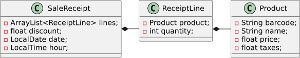

# Els patrons de disseny de software

Un patró de disseny de software permet avaluar i organitzar el codi implementat seguint el paradigma POO (programació orientada a objectes) per tal que aquest sigui tant modular, reutilitzable i de fàcil manteniment i ampliació com sigui possible.

De patrons de software n'existeixen molts, però els clàssics i, per tant, els més utilitzats, són un grup de 22, els quals estan organitzats en 3 categories principals:
* Patrons de creació
    * Factory Method
    * Abstract Factory
    * Builder
    * Prototype
    * Singleton
* Patrons estructurals
    * Adapter
    * Bridge
    * Composite
    * Decorator
    * Facade
    * Flyweight
    * Proxy
* Patrons de comportament
    * Chain of Responsibility
    * Command
    * Iterator
    * Mediator
    * Memento
    * Observer
    * State
    * Strategy
    * Template Methor
    * Visitor

Tots aquests patrons s'implementen sobre un conjunt de principis bàsics anomenats **GRASP** (*General Responsibility Assignment Software Patterns*). Si el codi POO no compleix aquests principis serà molt difícil dissenyar una arquitectura modular, adaptable i reutilitzable. En canvi, si el disseny està ben pensat, i l'aplicació està implementada seguint l'arquitectura **MVC** (*Model-View-Controller*), el codi complirà tots els requeriments de modularitat, reutilització, bon manteniment i fàcil ampliació desitjats.


**Avís.**

Cal tenir en compte que, en alguns casos, la POO i una arquitectura de sotware massa estricta poden fer que una aplicació perdi eficiència. Per tant, cal analitzar molt bé el problema a resoldre per tal de decidir la càrrega de disseny que necessita.


Aquest capítol tracta els següents coneixements:
* Patró d'assignació de responsabilitats *Expert*
* Patró d'assignació de responsabilitats *Creator*
* Patró d'assignació de responsabilitats *Controller*
* Patró clàssic de creació *Factory Method*
* Aquitectura MVC

## GRASP (*General Responsibility Assignment Software Patterns*)
L'objectiu principal dels principis GRAPS és aconseguir el mínim acoblament i la màxima cohesió en el codi implementat.

**Acoblament**: dependència que existeix entre les diferents classes/objectes que formen part del codi. Si dues classes (o objectes) estan acoblades vol dir que estan connectades, que tenen coneixement o que depenen l'una de l'altra. Això passa si:
1. La classe `A` té un atribut de la classe `B`.
2. La classe `A` té un mètode que utilitza la classe `B` (per exemple, retorna un objecte de `B`, rep un paràmetre de tipus `B` o crea un objecte de la classe `B` per fer els seus càlculs)
3. La classe `A` és una subclasse de `B`
4. La classe `A` implementa la interfície `B`

Si el codi implementat no gestiona correctament l'acoblament entre les classes, arribarà un moment en què serà molt difícil de treballar: els errors afectaran a moltes classes i costaran d'arreglar, no serà fàcilment ampliable ni modificable, no serà modular, etc.

**Cohesió**: una classe està cohesionada si les tasques que realitza (comportament, mètodes) estan focalitzades (conjunt reduït de funcionalitats) i estan relacionades entre si i amb les dades que emmagatzema (estat, atributs). En el moment en què una classe comença a fer *massa coses*, la seva cohesió baixa i, per tant, serà difícil de mantenir i de reutilitzar, així com també, es veurà afectada per moltes modificacions.

La cohesió afavoreix la col·laboració entre les classes (delegació de tasques).

### Patró d'assignació de responsabilitats *Expert*
El Patró *Expert* indica que cada classe/objecte és responsable de fer els càlculs per als quals té la informació necessària. És a dir, la classe (o l'objecte) és l'experta en informació i, per tant, és la responsable d'operar (mètodes) les seves dades (atributs). Dit d'una altra manera, cada classe/objecte té els mètodes necessaris que permeten operar els atributs que emmagatzema.

Si una classe (o un objecte) no té totes les dades necessàries per poder executar un dels seus mètodes es diu que és una *experta parcial en informació* i, per tant, haurà de col·laborar amb els objectes dels seus propis atributs, és a dir, haurà de delegar els càlculs als objectes que formen part dels seus atributs.

Aquest patró genera un baix desacoblament en el codi, perquè permet mantenir un molt bon encapsulament dels objectes i saber, clarament, qui pot donar resposta a les diverses necessitats i càlculs. A més a més, també n'augmenta la cohesió, perquè ajuda a fer una bona representació del món real dins del codi, distribuïnt el comportament entre les classes i facilitant la delegació de tasques (col·laboració).


**Informació.**

El patró d'assignació de responsabilitats *Expert* està molt relacionat amb el patró clàssic estructural *Composite* 



**Exercici**

Donat el diagrama de classes UML que es mostra a continuació, cal declarar i implementar tots els mètodes necessaris per poder assolir la funcionalitat *obtenir el total del tiquet de la compra*. El llenguatge que s'ha d'utilitzar és Java.

    <figure>
        
        <figcaption>
Diagrama UML de Classes que mostra un exemple inicial per aplicar el Patró *Expert*
</figcaption>
    </figure>

Atenció, només s'han d'implementar els mètodes estrictament necessaris. A més a més, tampoc fa falta crear el constructor, ja que, de moment,  es treballarà amb el constructor per defecte que garanteix Java.


### Patró d'assignació de responsabilitats *Creator*
El Patró *Creator* indica quina classe és la responsable de crear una nova instància d'una altra classe i es regeix per les normes següents:
1. La classe `A` té un atribut de la classe `B`, `A` serà responsable de crear la instància de `B`.
2. La classe `A` utilitza objectes de la classe `B` (per exemple, com a variables locals o retorn dels seus mètodes), `A` serà responsable de crear la instància de `B`.
3. Si la classe `A` té les dades d'inicialització per crear objectes de la classe `B`, `A` serà responsable de crear la instància de `B`.

En cas d'empat entre diverses possibilitats, es dóna preferència a la primera opció (la classe `A` té un atribut de la classe `B`).

Analitzant la seva definició, es pot veure que l'aplicació del patró *Creator* implica, directament, la del patró *Expert*: la classe que crea una instància ho fa perquè és l'experta, la que gestiona les dades per poder-ho fer.


**Exercici**

Recuperant l'exercici anterior, qui és el responsable de crear instàncies de la classe `ReceiptLine`? Implementa el constructor per defecte que creguis més adequat.
